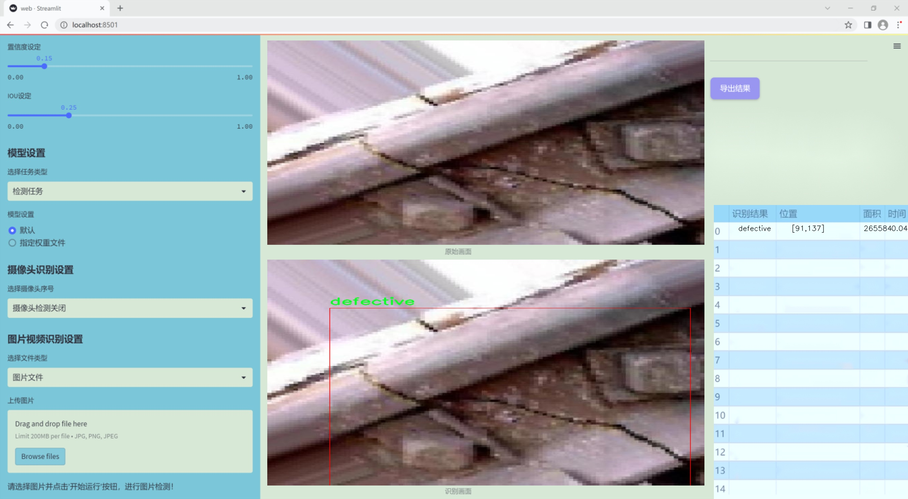
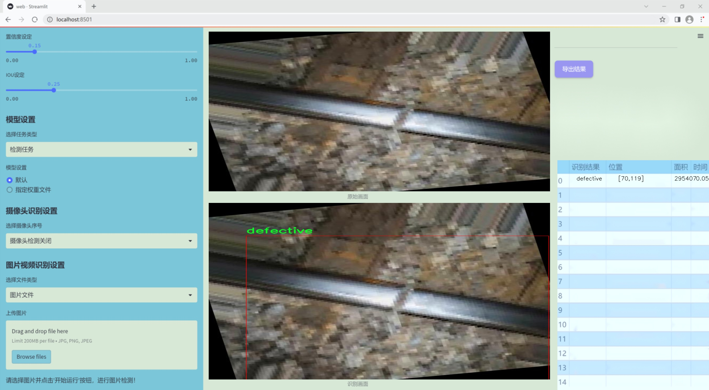
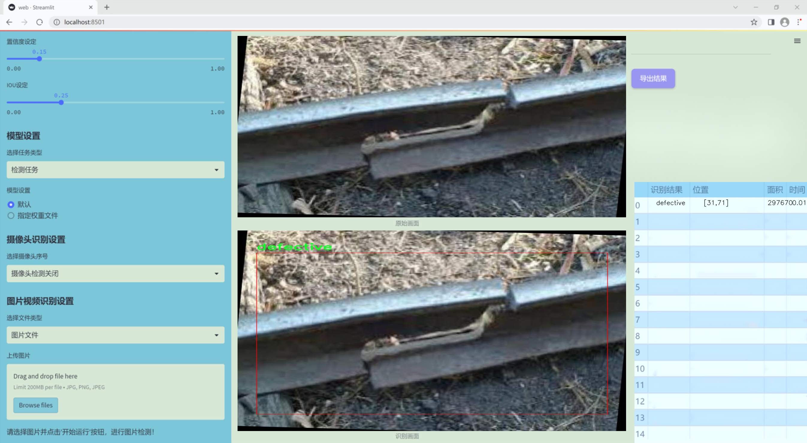
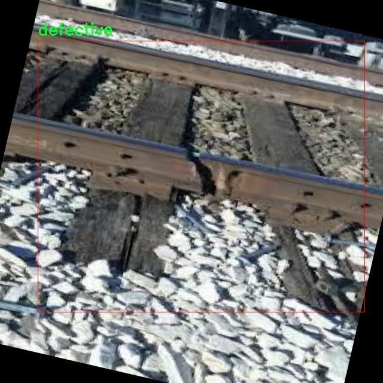
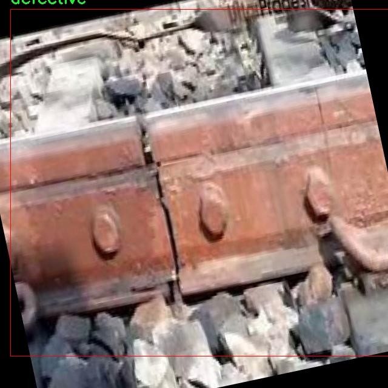
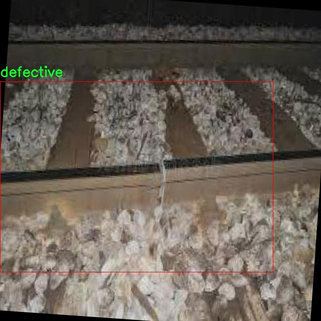
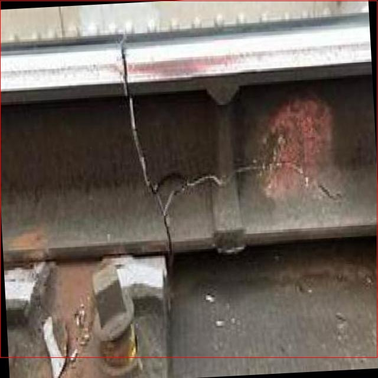
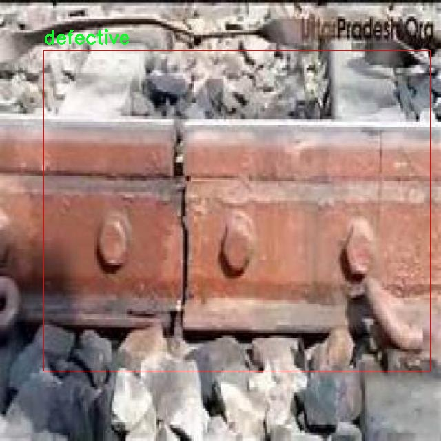

### 1.背景意义

研究背景与意义

铁路作为现代交通运输的重要组成部分，其安全性和可靠性直接影响到人们的出行和货物运输。随着铁路网络的不断扩展，轨道的维护和检测变得愈发重要。轨道缺陷不仅可能导致列车脱轨等严重事故，还会影响列车的运行效率和乘客的安全。因此，建立一个高效、准确的铁路轨道缺陷检测系统显得尤为迫切。

传统的轨道检测方法多依赖人工巡检，这不仅耗时耗力，而且容易受到人为因素的影响，检测结果的准确性和一致性难以保证。近年来，随着计算机视觉和深度学习技术的快速发展，基于图像处理的自动化检测方法逐渐成为研究热点。尤其是YOLO（You Only Look Once）系列目标检测算法，以其快速、准确的特点，广泛应用于各类物体检测任务中。

本研究旨在基于改进的YOLOv11算法，构建一个铁路轨道缺陷检测系统。通过利用一个包含2671张图像的数据集，该数据集涵盖了“缺陷”和“非缺陷”两类轨道状态，能够有效支持模型的训练与评估。数据集的图像经过精心的预处理和增强，确保了模型在不同环境和条件下的鲁棒性。这一系统的实现不仅可以提高轨道检测的效率，还能降低人为失误的风险，为铁路运营提供更加可靠的安全保障。

通过对轨道缺陷的自动化检测，能够及时发现潜在的安全隐患，进而采取相应的维护措施，延长轨道的使用寿命，减少事故发生的概率。此外，该系统的成功应用也为其他领域的自动化检测提供了借鉴，推动了计算机视觉技术在工业检测中的广泛应用。因此，本研究具有重要的理论价值和实际意义，期待能够为铁路安全管理提供新的解决方案。

### 2.视频效果

[2.1 视频效果](https://www.bilibili.com/video/BV1KvBYYkEyb/)

### 3.图片效果







##### [项目涉及的源码数据来源链接](https://kdocs.cn/l/cszuIiCKVNis)**

注意：本项目提供训练的数据集和训练教程,由于版本持续更新,暂不提供权重文件（best.pt）,请按照6.训练教程进行训练后实现上图演示的效果。

### 4.数据集信息

##### 4.1 本项目数据集类别数＆类别名

nc: 2
names: ['defective', 'non-defective']


该项目为【目标检测】数据集，请在【训练教程和Web端加载模型教程（第三步）】这一步的时候按照【目标检测】部分的教程来训练

##### 4.2 本项目数据集信息介绍

本项目数据集信息介绍

本项目旨在改进YOLOv11模型，以实现高效的铁路轨道缺陷检测系统。为此，我们构建了一个专门针对“铁路轨道缺陷检测”主题的数据集。该数据集包含两类主要类别，分别为“缺陷”（defective）和“非缺陷”（non-defective），共计类别数量为2。这一分类设计旨在帮助模型有效区分正常轨道与存在缺陷的轨道，从而提高检测的准确性和可靠性。

在数据集的构建过程中，我们综合考虑了铁路轨道的多样性和复杂性，确保所收集的样本能够涵盖不同类型的缺陷，包括但不限于裂缝、变形、腐蚀等。同时，为了增强模型的泛化能力，我们还收集了来自不同地理位置和气候条件下的轨道图像。这些图像在拍摄时遵循了一定的标准，确保了数据的质量和一致性。

数据集中的每一张图像都经过精心标注，确保缺陷区域的准确定位。通过这种方式，我们为YOLOv11模型的训练提供了丰富的样本，使其能够在实际应用中快速、准确地识别出轨道缺陷。此外，数据集还包含了多种光照和天气条件下的轨道图像，以模拟实际环境中的变化，进一步提升模型的鲁棒性。

总之，本项目的数据集不仅为YOLOv11的训练提供了坚实的基础，也为铁路安全监测技术的发展奠定了重要的理论和实践基础。通过对缺陷和非缺陷轨道的有效区分，我们期望能够显著提高铁路轨道的安全性和维护效率，为铁路运输的安全运营提供有力保障。











### 5.全套项目环境部署视频教程（零基础手把手教学）

[5.1 所需软件PyCharm和Anaconda安装教程（第一步）](https://www.bilibili.com/video/BV1BoC1YCEKi/?spm_id_from=333.999.0.0&vd_source=bc9aec86d164b67a7004b996143742dc)


[5.2 安装Python虚拟环境创建和依赖库安装视频教程（第二步）](https://www.bilibili.com/video/BV1ZoC1YCEBw?spm_id_from=333.788.videopod.sections&vd_source=bc9aec86d164b67a7004b996143742dc)

### 6.改进YOLOv11训练教程和Web_UI前端加载模型教程（零基础手把手教学）

[6.1 改进YOLOv11训练教程和Web_UI前端加载模型教程（第三步）](https://www.bilibili.com/video/BV1BoC1YCEhR?spm_id_from=333.788.videopod.sections&vd_source=bc9aec86d164b67a7004b996143742dc)


按照上面的训练视频教程链接加载项目提供的数据集，运行train.py即可开始训练



     Epoch   gpu_mem       box       obj       cls    labels  img_size
     1/200     20.8G   0.01576   0.01955  0.007536        22      1280: 100%|██████████| 849/849 [14:42<00:00,  1.04s/it]
               Class     Images     Labels          P          R     mAP@.5 mAP@.5:.95: 100%|██████████| 213/213 [01:14<00:00,  2.87it/s]
                 all       3395      17314      0.994      0.957      0.0957      0.0843

     Epoch   gpu_mem       box       obj       cls    labels  img_size
     2/200     20.8G   0.01578   0.01923  0.007006        22      1280: 100%|██████████| 849/849 [14:44<00:00,  1.04s/it]
               Class     Images     Labels          P          R     mAP@.5 mAP@.5:.95: 100%|██████████| 213/213 [01:12<00:00,  2.95it/s]
                 all       3395      17314      0.996      0.956      0.0957      0.0845

     Epoch   gpu_mem       box       obj       cls    labels  img_size
     3/200     20.8G   0.01561    0.0191  0.006895        27      1280: 100%|██████████| 849/849 [10:56<00:00,  1.29it/s]
               Class     Images     Labels          P          R     mAP@.5 mAP@.5:.95: 100%|███████   | 187/213 [00:52<00:00,  4.04it/s]
                 all       3395      17314      0.996      0.957      0.0957      0.0845


###### [项目数据集下载链接](https://kdocs.cn/l/cszuIiCKVNis)

### 7.原始YOLOv11算法讲解

YOLO11采用改进的骨干和颈部架构，增强了特征提取能力，提高了物体检测的精确度和复杂任务的表现。YOLO11引入精炼的架构设计和优化的训练流程，实现更快的处理速度，同时保持精度和性能之间的最佳平衡。通过模型设计的进步，YOLO11m在COCO数据集上实现了更高的均值平均精度（mAP），同时使用比YOLOv8m少22%的参数，使其在不妥协准确性的情况下更加计算高效。YOLO11可以无缝部署在各种环境中，包括边缘设备、云平台以及支持NVIDIA
GPU的系统，确保最大灵活性。无论是物体检测、实例分割、图像分类、姿态估计，还是定向物体检测（OBB），YOLO11都旨在应对多样的计算机视觉挑战。


##### **Ultralytics YOLO11相比于之前版本的主要改进有哪些？**

Ultralytics YOLO11在其前身基础上引入了几项重要进步。主要改进包括：

  1. **增强的特征提取** ：YOLO11采用改进的骨干和颈部架构，增强了特征提取能力，提高了物体检测的精确度。
  2.  **优化的效率和速度** ：精炼的架构设计和优化的训练流程实现了更快的处理速度，同时保持了准确性和性能之间的平衡。
  3.  **更高的准确性与更少的参数** ：YOLO11m在COCO数据集上实现了更高的均值平均精度（mAP），同时使用比YOLOv8m少22%的参数，使其在不妥协准确性的情况下更加计算高效。
  4.  **环境适应性强** ：YOLO11可以在多种环境中部署，包括边缘设备、云平台以及支持NVIDIA GPU的系统。
  5.  **支持广泛的任务** ：YOLO11支持多种计算机视觉任务，如物体检测、实例分割、图像分类、姿态估计和定向物体检测（OBB）。

我们先来看一下其网络结构有什么变化，可以看出，相比较于YOLOv8模型，其将CF2模块改成C3K2，同时在SPPF模块后面添加了一个C2PSA模块，且将YOLOv10的head思想引入到YOLO11的head中，使用深度可分离的方法，减少冗余计算，提高效率。下面我们来详细看一下这两个模块的结构是怎么构成的，以及它们为什么要这样设计


##### C3K2的网络结构

从下面图中我们可以看到，C3K2模块其实就是C2F模块转变出来的，它代码中有一个设置，就是当c3k这个参数为FALSE的时候，C3K2模块就是C2F模块，也就是说它的Bottleneck是普通的Bottleneck；反之当它为true的时候，将Bottleneck模块替换成C3模块。


##### C2PSA的网络结构

` `C2PSA是对 `C2f` 模块的扩展，它结合了PSA(Pointwise Spatial
Attention)块，用于增强特征提取和注意力机制。通过在标准 `C2f` 模块中引入 PSA
块，C2PSA实现了更强大的注意力机制，从而提高了模型对重要特征的捕捉能力。


##### **C2f 模块回顾：**

**** C2f模块是一个更快的 CSP（Cross Stage Partial）瓶颈实现，它通过两个卷积层和多个 Bottleneck
块进行特征提取。相比传统的 CSPNet，C2f 优化了瓶颈层的结构，使得计算速度更快。在 C2f中，`cv1` 是第一个 1x1
卷积，用于减少通道数；`cv2` 是另一个 1x1 卷积，用于恢复输出通道数。而 `n` 是一个包含 Bottleneck 块的数量，用于提取特征。

##### **C2PSA 模块的增强** ：

**C2PSA** 扩展了 C2f，通过引入PSA( **Position-Sensitive Attention)**
，旨在通过多头注意力机制和前馈神经网络来增强特征提取能力。它可以选择性地添加残差结构（shortcut）以优化梯度传播和网络训练效果。同时，使用FFN
可以将输入特征映射到更高维的空间，捕获输入特征的复杂非线性关系，允许模型学习更丰富的特征表示。

##### head部分

YOLO11在head部分的cls分支上使用深度可分离卷积 ，具体代码如下，cv2边界框回归分支，cv3分类分支。

    
    
     self.cv2 = nn.ModuleList(
                nn.Sequential(Conv(x, c2, 3), Conv(c2, c2, 3), nn.Conv2d(c2, 4 * self.reg_max, 1)) for x in ch
            )
            self.cv3 = nn.ModuleList(
                nn.Sequential(
                    nn.Sequential(DWConv(x, x, 3), Conv(x, c3, 1)),
                    nn.Sequential(DWConv(c3, c3, 3), Conv(c3, c3, 1)),
                    nn.Conv2d(c3, self.nc, 1),
                )
                for x in ch
            )


### 8.200+种全套改进YOLOV11创新点原理讲解

#### 8.1 200+种全套改进YOLOV11创新点原理讲解大全

由于篇幅限制，每个创新点的具体原理讲解就不全部展开，具体见下列网址中的改进模块对应项目的技术原理博客网址【Blog】（创新点均为模块化搭建，原理适配YOLOv5~YOLOv11等各种版本）

[改进模块技术原理博客【Blog】网址链接](https://gitee.com/qunmasj/good)


#### 8.2 精选部分改进YOLOV11创新点原理讲解

###### 这里节选部分改进创新点展开原理讲解(完整的改进原理见上图和[改进模块技术原理博客链接](https://gitee.com/qunmasj/good)【如果此小节的图加载失败可以通过CSDN或者Github搜索该博客的标题访问原始博客，原始博客图片显示正常】

### AutoFocus: Efficient Multi-Scale Conv简介

参考该博客提出了AutoFocus，一种高效的多尺度目标检测算法。相较于以前对整个图像金字塔进行处理，该方法以一种由表及里的姿态，仅处理哪些整体上看来很有可能存在小物体的区域。这个可以通过预测一张类别未知的分割图FocusPixels来得到。为了高效利用FocusPixels，另外一个算法用于产生包含FocusPixels的FocusChips，这样可以减少计算量并处理更更精细的尺度。在不同尺度上FocusChips所得到的检测结果综合时，会出现问题，我们也提供了解决问题的方案。AutoFocus在COCO上的结果有49.7%mAP（50%重叠下68.3%），与多尺度baseline相仿但是快了2.5倍。金字塔中处理的像素数量减少了5倍mAP只下降1%，在与RetinaNet采用相同的ResNet-101结构且速度相同时，高了10%mAP。

人类寻找物体是一个动态的过程，且寻找时间与场景的复杂度是直接相关的。当我们的眼神在不同的点之间漂移时，其他的区域会被我们有意忽视。然而，现在的检测算法是一种静态的推理过程且图像金字塔中的每个像素都受到了一样的对待，这使得过程变得没有效率。现在许多的应用都不强调实时性，而计算上的节省其实可以产生很大收益。

在COCO数据集中，虽然40%的物体都是小物体，但是它们一共只占了全图的0.3%。如果金字塔是3倍关系，则在高分辨率层要进行9倍的运算。XXX 。那么有没有办法在低分辨率下找出可能含有这些物体的区域呢？

以人眼方案类比，我们可以从低分辨率图像开始，找出有可能存在物体的区域再“聚集”到高分辨率。我们的AutoFocus会在一层中计算小物体的分割图FocusPixels，而在每一个FocusPixels上会用一个算法产生下一层所需要关注的chips。在COCO的最大分辨率层上我们可以只处理**20%的像素而性能不下降，如果只处理5%**也只下降1%而已。


图像金字塔与卷积神经网络对CV十分重要。然而卷积神经网络无法做到对尺度不敏感，所以为了不同大小的物体需要依赖图像金字塔。虽然训练已经有了高效的方法，但是其推断时间依然远离实际使用标准。

目标检测加速有很长历史了。常用的有特征近似以减少尺度、级联、特征金字塔，且最后一个最近很多人研究。

AutoFocus为速度与精度之间提供了一个平滑的折衷，指出可以在低分辨率下看出小物体的所在，从而节约计算。FocusPixels的计算较为容易。

先简单介绍一下SNIP，是一种多尺度的训练、推断算法。主要思想是训练针对某个特定scale的检测器而不是scale-invariant检测器。这样训练样本就局限于在某个尺度范围内，以适于这个检测器处理。比如在高分辨率仅处理小物体而高分辨率仅处理大物体，其优势在于训练时不用考虑尺度的变化。

由于训练时物体大小是已知的，我们在图像金字塔中可以忽略大量区域而只处理物体周围的区域。SNIPER说明这样低分辨率的训练与全图训练相比并不会降低性能。同样，在推断过程中如果可以在大分辨率图像上预测可能出现小物体的chip，我们也就不用处理整张高分辨率图片。在训练时，许多物体会被裁剪、扭曲，这可以当作是一种数据扩增，然而当这个情况在推断时出现，则会产生错误，所以我们还需要一个算法来整合不同尺度上的检测结果。

#### AutoFocus框架
如SIFT、SURF等传统分类特征包含两个组件，一个detector和一个descriptor。detector只包含轻量级的操作如DoG、LoG，用于在整张图片上找到感兴趣的区域；descriptor，一般来说计算量比较大，则只需要关注那些咸兴趣的区域。这个级联结构保障了图片处理的效率。

同样，AutoFocus框架也是用于预测感兴趣的区域，并丢弃在下一尺度不可能存在物体的区域，并将裁剪和缩放后的区域传递给下一尺度。AutoFocus由三个部分组成：FocusPixels，FocusChips和focus stacking。

#### FocusPixels
FocusPixels定义在卷积网络特征图的粒度之上（如conv5），如果特征图上某个像素与小物体有重叠则标注为一个FocusPixel。（小物体：面积处于一个网络的输入范围之内）。训练过程中，FocusPixels标注为正，某些与不在面积范围内的物体有重叠的像素标注为无效，其他像素标注为负。AutoFocus的训练目标是使在FocusPixels区域产生较大的激活值。

如果同时多个物体与同一像素重叠，优先给正标注。我们的网络输入是512x512，然后a,b,c取值分别是5,64,90。对于太大或太小的物体，我们认为当前尺度上没有足够人信息进行判断，所以会标定为无效。整个网络结构如下图。训练时加两层带ReLU的卷积(3x3和1x1)以及一个二分类softmax来预测FocusPixels。


#### FocusChip生成
推断过程中，我们标注输出概率大于阈值t的像素（这个参数可以控制加速比），得到一些连通域。对于每一个域，我们做一次膨胀使其包含一些有助于识别的周围信息，膨胀后相连的部分要合并。然后，我们生成一些包含连通域的chips（不同chips可能重叠，如有重叠则合并）。有些chip可能太小缺少必要信息，并使chip的大小变化很大，为了效率我们要求保证一个最小的chip size。算法流程如下：


#### 级联推断过程
我们的过程类似于图片金字塔的推断过程但是在过程中一步步去除不关注的图片区域。我们在最低分辨率上进行检测并生成chips，然后在这些chips再进行检测和生成chips。

#### Focus Stacking
这种级联分类器的一个问题是在chip边缘本来的大物体可能生成一些被剪裁的检测目标。在下一个尺度上，由于剪裁过了，所以会检测到小的、错误的正例False Positive。之前算法中的第二步膨胀其实就是为了保证没有物体会出现在chip的边缘。这样，当我们在局部图片chip的边缘检测到物体时，就可以把这个检测结果丢弃，即使其在SNIP的范围内。

也有一些物体在图片边缘的特殊情况。如果chip和图片共享一条边的话，我们会检查检测结果的其他边是否完全在里面，如果在，则保留它，否则丢弃。

在每一尺度得到有效检测结果后，我们可以将不同尺度上的结果进行整合，将这些结果映射到原图坐标系上。最后，非极大值抑制NMS用于聚集。网络结构如之前的图片所示。


### 9.系统功能展示

图9.1.系统支持检测结果表格显示

  图9.2.系统支持置信度和IOU阈值手动调节

  图9.3.系统支持自定义加载权重文件best.pt(需要你通过步骤5中训练获得)

  图9.4.系统支持摄像头实时识别

  图9.5.系统支持图片识别

  图9.6.系统支持视频识别

  图9.7.系统支持识别结果文件自动保存

  图9.8.系统支持Excel导出检测结果数据


### 10. YOLOv11核心改进源码讲解

#### 10.1 deconv.py

以下是对给定代码的核心部分进行提炼和详细注释的结果：

```python
import math
import torch
from torch import nn
from einops.layers.torch import Rearrange

# 定义一个卷积层类，包含自定义的权重获取方法
class Conv2d_cd(nn.Module):
    def __init__(self, in_channels, out_channels, kernel_size=3, stride=1,
                 padding=1, dilation=1, groups=1, bias=False, theta=1.0):
        super(Conv2d_cd, self).__init__()
        # 初始化标准的2D卷积层
        self.conv = nn.Conv2d(in_channels, out_channels, kernel_size=kernel_size, stride=stride, padding=padding, dilation=dilation, groups=groups, bias=bias)
        self.theta = theta  # 可调参数

    def get_weight(self):
        # 获取卷积层的权重并进行处理
        conv_weight = self.conv.weight
        conv_shape = conv_weight.shape
        # 将权重形状调整为(c_in, c_out, k1*k2)
        conv_weight = Rearrange('c_in c_out k1 k2 -> c_in c_out (k1 k2)')(conv_weight)
        # 创建一个新的权重张量，初始化为0
        conv_weight_cd = torch.zeros(conv_shape[0], conv_shape[1], 3 * 3, device=conv_weight.device, dtype=conv_weight.dtype)
        # 将原权重复制到新权重张量中
        conv_weight_cd[:, :, :] = conv_weight[:, :, :]
        # 调整权重，使其满足特定条件
        conv_weight_cd[:, :, 4] = conv_weight[:, :, 4] - conv_weight[:, :, :].sum(2)
        # 恢复权重形状为(c_in, c_out, k1, k2)
        conv_weight_cd = Rearrange('c_in c_out (k1 k2) -> c_in c_out k1 k2', k1=conv_shape[2], k2=conv_shape[3])(conv_weight_cd)
        return conv_weight_cd, self.conv.bias  # 返回处理后的权重和偏置


# 定义DEConv类，整合多个卷积层
class DEConv(nn.Module):
    def __init__(self, dim):
        super(DEConv, self).__init__()
        # 初始化多个自定义卷积层
        self.conv1_1 = Conv2d_cd(dim, dim, 3, bias=True)
        self.conv1_2 = Conv2d_cd(dim, dim, 3, bias=True)  # 这里可以替换为其他卷积类
        self.conv1_3 = Conv2d_cd(dim, dim, 3, bias=True)  # 这里可以替换为其他卷积类
        self.conv1_4 = Conv2d_cd(dim, dim, 3, bias=True)  # 这里可以替换为其他卷积类
        self.conv1_5 = nn.Conv2d(dim, dim, 3, padding=1, bias=True)  # 标准卷积层
        
        self.bn = nn.BatchNorm2d(dim)  # 批归一化层
        self.act = nn.ReLU()  # 激活函数

    def forward(self, x):
        # 前向传播，计算输出
        w1, b1 = self.conv1_1.get_weight()
        w2, b2 = self.conv1_2.get_weight()
        w3, b3 = self.conv1_3.get_weight()
        w4, b4 = self.conv1_4.get_weight()
        w5, b5 = self.conv1_5.weight, self.conv1_5.bias

        # 将所有卷积层的权重和偏置相加
        w = w1 + w2 + w3 + w4 + w5
        b = b1 + b2 + b3 + b4 + b5
        # 使用加权卷积计算输出
        res = nn.functional.conv2d(input=x, weight=w, bias=b, stride=1, padding=1, groups=1)

        # 应用批归一化和激活函数
        res = self.bn(res)
        return self.act(res)

    def switch_to_deploy(self):
        # 将多个卷积层的权重合并为一个卷积层的权重
        w1, b1 = self.conv1_1.get_weight()
        w2, b2 = self.conv1_2.get_weight()
        w3, b3 = self.conv1_3.get_weight()
        w4, b4 = self.conv1_4.get_weight()
        w5, b5 = self.conv1_5.weight, self.conv1_5.bias

        # 合并权重和偏置
        self.conv1_5.weight = torch.nn.Parameter(w1 + w2 + w3 + w4 + w5)
        self.conv1_5.bias = torch.nn.Parameter(b1 + b2 + b3 + b4 + b5)

        # 删除不再需要的卷积层
        del self.conv1_1
        del self.conv1_2
        del self.conv1_3
        del self.conv1_4

# 测试代码
if __name__ == '__main__':
    data = torch.randn((1, 128, 64, 64)).cuda()  # 随机生成输入数据
    model = DEConv(128).cuda()  # 初始化模型
    output1 = model(data)  # 计算第一次输出
    model.switch_to_deploy()  # 切换到部署模式
    output2 = model(data)  # 计算第二次输出
    print(torch.allclose(output1, output2))  # 检查两次输出是否相近
```

### 代码核心部分说明：
1. **卷积层类（如`Conv2d_cd`）**：定义了自定义的卷积层，包含权重获取和处理的逻辑。
2. **DEConv类**：整合多个卷积层，提供前向传播和权重合并的方法。
3. **前向传播逻辑**：通过合并多个卷积层的权重和偏置来实现高效的计算。
4. **部署模式切换**：将多个卷积层的权重合并为一个卷积层，以提高推理效率。

这些部分是实现卷积神经网络中自定义卷积操作的核心逻辑。

这个程序文件 `deconv.py` 定义了一些自定义的卷积层以及一个名为 `DEConv` 的模型。整个文件的核心是实现不同类型的卷积操作，并在 `DEConv` 类中将这些卷积层组合在一起。以下是对代码的逐步分析和说明。

首先，文件导入了一些必要的库，包括 `math`、`torch` 和 `torch.nn`，以及 `einops` 库中的 `Rearrange` 类。`Conv` 是一个自定义模块，可能在其他地方定义。`fuse_conv_and_bn` 是一个用于融合卷积层和批归一化层的函数。

接下来，定义了多个卷积类：

1. **Conv2d_cd**：这是一个自定义的二维卷积层，构造函数中初始化了一个标准的 `nn.Conv2d` 卷积层。`get_weight` 方法用于获取卷积权重，并对其进行重新排列和处理，生成一个新的权重张量。

2. **Conv2d_ad**：与 `Conv2d_cd` 类似，但在 `get_weight` 方法中对权重进行了不同的处理，使用了一个参数 `theta` 来调整权重。

3. **Conv2d_rd**：这个类的 `forward` 方法实现了条件卷积操作，如果 `theta` 接近于零，则执行标准卷积；否则，计算一个新的权重并进行卷积。

4. **Conv2d_hd** 和 **Conv2d_vd**：这两个类分别实现了一维卷积的变体，主要用于获取和处理权重。

接下来是 `DEConv` 类的定义。这个类是一个组合卷积层的模型，构造函数中初始化了多个自定义卷积层。`forward` 方法中，将各个卷积层的权重和偏置相加，然后通过 `nn.functional.conv2d` 进行卷积操作，最后应用批归一化和激活函数。

`switch_to_deploy` 方法用于将模型切换到部署模式。在这个方法中，所有卷积层的权重和偏置被合并到最后一个卷积层中，从而减少模型的复杂性和计算量。

最后，在 `__main__` 部分，创建了一个随机输入数据，并实例化 `DEConv` 模型。通过模型的 `forward` 方法计算输出，并在切换到部署模式后再次计算输出，最后验证两个输出是否相等。

总体来说，这个文件实现了一个灵活的卷积神经网络结构，允许用户根据需要调整卷积操作的权重，并提供了模型在训练和部署阶段的不同处理方式。

#### 10.2 mamba_yolo.py

以下是代码中最核心的部分，并附上详细的中文注释：

```python
import torch
import torch.nn as nn
from einops import rearrange

class LayerNorm2d(nn.Module):
    """自定义的二维层归一化类"""
    def __init__(self, normalized_shape, eps=1e-6, elementwise_affine=True):
        super().__init__()
        # 初始化层归一化
        self.norm = nn.LayerNorm(normalized_shape, eps, elementwise_affine)

    def forward(self, x):
        # 调整输入张量的维度顺序以适应LayerNorm
        x = rearrange(x, 'b c h w -> b h w c').contiguous()
        x = self.norm(x)  # 应用层归一化
        # 还原输入张量的维度顺序
        x = rearrange(x, 'b h w c -> b c h w').contiguous()
        return x

class CrossScan(torch.autograd.Function):
    """自定义的交叉扫描操作"""
    @staticmethod
    def forward(ctx, x: torch.Tensor):
        B, C, H, W = x.shape  # 获取输入张量的形状
        ctx.shape = (B, C, H, W)  # 保存形状以备后用
        xs = x.new_empty((B, 4, C, H * W))  # 创建新的张量用于存储交叉扫描结果
        xs[:, 0] = x.flatten(2, 3)  # 直接展平
        xs[:, 1] = x.transpose(dim0=2, dim1=3).flatten(2, 3)  # 转置后展平
        xs[:, 2:4] = torch.flip(xs[:, 0:2], dims=[-1])  # 翻转前两个结果
        return xs

    @staticmethod
    def backward(ctx, ys: torch.Tensor):
        # 反向传播
        B, C, H, W = ctx.shape
        L = H * W
        ys = ys[:, 0:2] + ys[:, 2:4].flip(dims=[-1]).view(B, 2, -1, L)  # 计算梯度
        y = ys[:, 0] + ys[:, 1].view(B, -1, W, H).transpose(dim0=2, dim1=3).contiguous().view(B, -1, L)
        return y.view(B, -1, H, W)  # 返回梯度

class SelectiveScanCore(torch.autograd.Function):
    """自定义的选择性扫描核心操作"""
    @staticmethod
    @torch.cuda.amp.custom_fwd
    def forward(ctx, u, delta, A, B, C, D=None, delta_bias=None, delta_softplus=False, nrows=1, backnrows=1, oflex=True):
        # 确保输入张量是连续的
        if u.stride(-1) != 1:
            u = u.contiguous()
        if delta.stride(-1) != 1:
            delta = delta.contiguous()
        if D is not None and D.stride(-1) != 1:
            D = D.contiguous()
        if B.stride(-1) != 1:
            B = B.contiguous()
        if C.stride(-1) != 1:
            C = C.contiguous()
        if B.dim() == 3:
            B = B.unsqueeze(dim=1)  # 扩展维度
            ctx.squeeze_B = True
        if C.dim() == 3:
            C = C.unsqueeze(dim=1)  # 扩展维度
            ctx.squeeze_C = True
        ctx.delta_softplus = delta_softplus
        ctx.backnrows = backnrows
        # 调用CUDA核心的前向函数
        out, x, *rest = selective_scan_cuda_core.fwd(u, delta, A, B, C, D, delta_bias, delta_softplus, 1)
        ctx.save_for_backward(u, delta, A, B, C, D, delta_bias, x)  # 保存用于反向传播的张量
        return out

    @staticmethod
    @torch.cuda.amp.custom_bwd
    def backward(ctx, dout, *args):
        # 反向传播
        u, delta, A, B, C, D, delta_bias, x = ctx.saved_tensors
        if dout.stride(-1) != 1:
            dout = dout.contiguous()
        du, ddelta, dA, dB, dC, dD, ddelta_bias, *rest = selective_scan_cuda_core.bwd(
            u, delta, A, B, C, D, delta_bias, dout, x, ctx.delta_softplus, 1
        )
        return (du, ddelta, dA, dB, dC, dD, ddelta_bias, None, None, None, None)  # 返回梯度

def cross_selective_scan(x: torch.Tensor, x_proj_weight: torch.Tensor, dt_projs_weight: torch.Tensor, A_logs: torch.Tensor, Ds: torch.Tensor, out_norm: torch.nn.Module = None):
    """交叉选择性扫描的主函数"""
    B, D, H, W = x.shape  # 获取输入张量的形状
    L = H * W  # 计算展平后的长度

    xs = CrossScan.apply(x)  # 进行交叉扫描
    x_dbl = torch.einsum("b k d l, k c d -> b k c l", xs, x_proj_weight)  # 矩阵乘法
    dts, Bs, Cs = torch.split(x_dbl, [R, N, N], dim=2)  # 拆分张量
    dts = torch.einsum("b k r l, k d r -> b k d l", dts, dt_projs_weight)  # 继续进行矩阵乘法

    # HiPPO矩阵
    As = -torch.exp(A_logs.to(torch.float))  # 计算A矩阵
    Ds = Ds.to(torch.float)  # 转换Ds的类型
    delta_bias = dt_projs_bias.view(-1).to(torch.float)  # 处理偏置

    # 调用选择性扫描
    ys: torch.Tensor = selective_scan(xs, dts, As, Bs, Cs, Ds, delta_bias, delta_softplus).view(B, K, -1, H, W)
    y: torch.Tensor = CrossMerge.apply(ys)  # 进行交叉合并

    # 进行输出归一化
    if out_norm is not None:
        y = out_norm(y)  # 应用归一化层

    return y  # 返回最终输出
```

### 代码核心部分解释：
1. **LayerNorm2d**: 实现了一个二维层归一化的模块，适用于图像数据的归一化处理。
2. **CrossScan**: 自定义的交叉扫描操作，能够在输入张量上进行特定的变换和展平，适用于处理图像特征。
3. **SelectiveScanCore**: 实现了选择性扫描的核心逻辑，包含前向和反向传播的计算，利用CUDA加速。
4. **cross_selective_scan**: 该函数整合了交叉扫描和选择性扫描的操作，进行特征提取和变换，最终输出经过归一化的结果。

这些部分构成了模型中处理图像特征的核心逻辑，适用于计算机视觉任务。

这个程序文件 `mamba_yolo.py` 是一个用于实现 YOLO（You Only Look Once）目标检测模型的 PyTorch 模块。文件中包含了多个类和函数，主要用于构建神经网络的不同层和模块。以下是对文件中主要部分的讲解。

首先，文件导入了一些必要的库，包括 `torch`、`math`、`functools` 和 `torch.nn`，以及一些用于张量操作的库，如 `einops` 和 `timm.layers`。文件还尝试导入了一些 CUDA 相关的模块，用于加速计算。

接下来，定义了一个 `LayerNorm2d` 类，它是一个二维层归一化的实现。这个类的 `forward` 方法对输入的张量进行维度重排，以适应 `LayerNorm` 的要求，然后再将其转换回原来的形状。

`autopad` 函数用于自动计算卷积操作所需的填充，以确保输出的形状与输入相同。

接下来是 `CrossScan` 和 `CrossMerge` 类，它们实现了交叉扫描和交叉合并的功能，主要用于处理输入张量的不同维度，以便进行更复杂的特征提取。

`SelectiveScanCore` 类是一个自定义的 PyTorch 自动求导函数，负责执行选择性扫描操作。它的 `forward` 和 `backward` 方法分别定义了前向传播和反向传播的计算过程。

`cross_selective_scan` 函数则是一个高层次的接口，用于调用选择性扫描操作，处理输入张量并返回结果。

`SS2D` 类是一个重要的模块，负责实现 S4D（State Space for Sequence Processing）结构。它包含多个参数和层，包括输入投影、卷积层、输出投影等。`forward` 方法实现了该模块的前向传播逻辑。

接下来定义了一些其他的模块，如 `RGBlock`、`LSBlock`、`XSSBlock` 和 `VSSBlock_YOLO`，这些模块实现了不同的网络结构和功能，主要用于特征提取和处理。

`SimpleStem` 类是一个简单的网络结构，用于处理输入数据并生成特征表示。它包含多个卷积层和激活函数。

最后，`VisionClueMerge` 类用于将多个特征图合并为一个输出特征图，主要通过对输入张量进行切片和拼接操作来实现。

整体来看，这个文件实现了一个复杂的目标检测模型的基础结构，包含了多种自定义的层和模块，能够有效地处理图像数据并提取特征。

#### 10.3 kan_conv.py

以下是经过简化并添加详细中文注释的核心代码部分：

```python
import torch
import torch.nn as nn

class KANConvNDLayer(nn.Module):
    def __init__(self, conv_class, norm_class, input_dim, output_dim, spline_order, kernel_size,
                 groups=1, padding=0, stride=1, dilation=1,
                 ndim: int = 2, grid_size=5, base_activation=nn.GELU, grid_range=[-1, 1], dropout=0.0):
        super(KANConvNDLayer, self).__init__()
        
        # 初始化参数
        self.inputdim = input_dim  # 输入维度
        self.outdim = output_dim    # 输出维度
        self.spline_order = spline_order  # 样条阶数
        self.kernel_size = kernel_size  # 卷积核大小
        self.padding = padding  # 填充
        self.stride = stride  # 步幅
        self.dilation = dilation  # 膨胀
        self.groups = groups  # 分组数
        self.ndim = ndim  # 维度
        self.grid_size = grid_size  # 网格大小
        self.base_activation = base_activation()  # 基础激活函数
        self.grid_range = grid_range  # 网格范围

        # 初始化dropout层
        self.dropout = None
        if dropout > 0:
            if ndim == 1:
                self.dropout = nn.Dropout1d(p=dropout)
            elif ndim == 2:
                self.dropout = nn.Dropout2d(p=dropout)
            elif ndim == 3:
                self.dropout = nn.Dropout3d(p=dropout)

        # 检查分组数和维度的有效性
        if groups <= 0:
            raise ValueError('groups must be a positive integer')
        if input_dim % groups != 0:
            raise ValueError('input_dim must be divisible by groups')
        if output_dim % groups != 0:
            raise ValueError('output_dim must be divisible by groups')

        # 创建基础卷积层和样条卷积层
        self.base_conv = nn.ModuleList([conv_class(input_dim // groups,
                                                   output_dim // groups,
                                                   kernel_size,
                                                   stride,
                                                   padding,
                                                   dilation,
                                                   groups=1,
                                                   bias=False) for _ in range(groups)])

        self.spline_conv = nn.ModuleList([conv_class((grid_size + spline_order) * input_dim // groups,
                                                     output_dim // groups,
                                                     kernel_size,
                                                     stride,
                                                     padding,
                                                     dilation,
                                                     groups=1,
                                                     bias=False) for _ in range(groups)])

        # 创建归一化层和激活层
        self.layer_norm = nn.ModuleList([norm_class(output_dim // groups) for _ in range(groups)])
        self.prelus = nn.ModuleList([nn.PReLU() for _ in range(groups)])

        # 初始化网格
        h = (self.grid_range[1] - self.grid_range[0]) / grid_size
        self.grid = torch.linspace(
            self.grid_range[0] - h * spline_order,
            self.grid_range[1] + h * spline_order,
            grid_size + 2 * spline_order + 1,
            dtype=torch.float32
        )

        # 使用Kaiming均匀分布初始化卷积层权重
        for conv_layer in self.base_conv:
            nn.init.kaiming_uniform_(conv_layer.weight, nonlinearity='linear')

        for conv_layer in self.spline_conv:
            nn.init.kaiming_uniform_(conv_layer.weight, nonlinearity='linear')

    def forward_kan(self, x, group_index):
        # 对输入应用基础激活函数并进行线性变换
        base_output = self.base_conv[group_index](self.base_activation(x))

        x_uns = x.unsqueeze(-1)  # 扩展维度以进行样条操作
        target = x.shape[1:] + self.grid.shape  # 计算目标形状
        grid = self.grid.view(*list([1 for _ in range(self.ndim + 1)] + [-1, ])).expand(target).contiguous().to(x.device)

        # 计算样条基
        bases = ((x_uns >= grid[..., :-1]) & (x_uns < grid[..., 1:])).to(x.dtype)

        # 计算多阶样条基
        for k in range(1, self.spline_order + 1):
            left_intervals = grid[..., :-(k + 1)]
            right_intervals = grid[..., k:-1]
            delta = torch.where(right_intervals == left_intervals, torch.ones_like(right_intervals),
                                right_intervals - left_intervals)
            bases = ((x_uns - left_intervals) / delta * bases[..., :-1]) + \
                    ((grid[..., k + 1:] - x_uns) / (grid[..., k + 1:] - grid[..., 1:(-k)]) * bases[..., 1:])
        bases = bases.contiguous()
        bases = bases.moveaxis(-1, 2).flatten(1, 2)  # 调整基的形状
        spline_output = self.spline_conv[group_index](bases)  # 应用样条卷积
        x = self.prelus[group_index](self.layer_norm[group_index](base_output + spline_output))  # 归一化和激活

        if self.dropout is not None:
            x = self.dropout(x)  # 应用dropout

        return x

    def forward(self, x):
        # 将输入按组分割
        split_x = torch.split(x, self.inputdim // self.groups, dim=1)
        output = []
        for group_ind, _x in enumerate(split_x):
            y = self.forward_kan(_x.clone(), group_ind)  # 对每个组应用forward_kan
            output.append(y.clone())
        y = torch.cat(output, dim=1)  # 将输出拼接
        return y
```

### 代码说明：
1. **KANConvNDLayer**：这是一个自定义的卷积层，支持多维卷积操作，使用样条基函数进行卷积。
2. **初始化方法**：在初始化中设置了卷积层、归一化层、激活函数、dropout等。
3. **forward_kan方法**：实现了具体的前向传播逻辑，包括基础卷积、样条基计算和激活。
4. **forward方法**：将输入按组分割，并对每个组应用`forward_kan`，最后将结果拼接在一起。

这个程序文件定义了一个名为 `KANConvNDLayer` 的神经网络层，旨在实现一种新的卷积操作，结合了样条插值和标准卷积的特性。该层可以处理多维输入数据（如1D、2D、3D），并且可以通过不同的激活函数和归一化方法进行配置。

在 `KANConvNDLayer` 的构造函数中，首先初始化了一些基本参数，包括输入和输出维度、卷积核大小、样条阶数、步幅、填充、扩张率、分组数等。构造函数还检查了分组数的有效性，并确保输入和输出维度能够被分组数整除。

接下来，构造函数创建了多个卷积层和归一化层的模块列表。`base_conv` 列表包含了基础卷积层，而 `spline_conv` 列表则用于实现样条卷积。每个分组都有对应的归一化层和 PReLU 激活函数。

在 `forward_kan` 方法中，输入数据首先经过基础卷积层和激活函数的处理。然后，程序计算样条基函数，利用输入数据和预定义的网格进行插值。通过样条基函数的计算，得到样条卷积的输出，最后将基础卷积输出和样条卷积输出相加，并经过归一化和激活函数处理。如果设置了 dropout，则会在最后应用 dropout。

`forward` 方法负责处理输入数据的分组，将输入分割成多个部分，并对每个部分调用 `forward_kan` 方法，最后将所有输出拼接在一起。

此外，文件中还定义了三个子类 `KANConv1DLayer`、`KANConv2DLayer` 和 `KANConv3DLayer`，分别对应一维、二维和三维卷积操作。这些子类通过调用父类的构造函数，传入相应的卷积类和归一化类来实现特定维度的卷积层。

整体而言，这个程序实现了一种灵活且强大的卷积层，能够适应不同维度的输入数据，并结合了样条插值的优点，适用于各种深度学习任务。

#### 10.4 dynamic_snake_conv.py

以下是经过简化和注释的核心代码部分，主要包括 `DySnakeConv` 和 `DSConv` 类的实现，以及 `DSC` 类的部分功能。注释详细解释了每个部分的功能和参数。

```python
import torch
import torch.nn as nn
from ..modules.conv import Conv  # 导入自定义的卷积模块

__all__ = ['DySnakeConv']  # 指定导出的模块

class DySnakeConv(nn.Module):
    def __init__(self, inc, ouc, k=3) -> None:
        """
        动态蛇形卷积的初始化
        :param inc: 输入通道数
        :param ouc: 输出通道数
        :param k: 卷积核大小，默认为3
        """
        super().__init__()
        
        # 定义三个卷积层
        self.conv_0 = Conv(inc, ouc, k)  # 标准卷积
        self.conv_x = DSConv(inc, ouc, 0, k)  # 沿x轴的动态蛇形卷积
        self.conv_y = DSConv(inc, ouc, 1, k)  # 沿y轴的动态蛇形卷积
    
    def forward(self, x):
        """
        前向传播
        :param x: 输入特征图
        :return: 拼接后的输出特征图
        """
        # 将三个卷积的输出在通道维度上拼接
        return torch.cat([self.conv_0(x), self.conv_x(x), self.conv_y(x)], dim=1)

class DSConv(nn.Module):
    def __init__(self, in_ch, out_ch, morph, kernel_size=3, if_offset=True, extend_scope=1):
        """
        动态蛇形卷积的初始化
        :param in_ch: 输入通道数
        :param out_ch: 输出通道数
        :param morph: 卷积核的形态（0: x轴，1: y轴）
        :param kernel_size: 卷积核大小
        :param if_offset: 是否需要偏移（变形）
        :param extend_scope: 扩展范围，默认为1
        """
        super(DSConv, self).__init__()
        # 用于学习可变形偏移的卷积层
        self.offset_conv = nn.Conv2d(in_ch, 2 * kernel_size, 3, padding=1)
        self.bn = nn.BatchNorm2d(2 * kernel_size)  # 批归一化
        self.kernel_size = kernel_size

        # 定义沿x轴和y轴的动态蛇形卷积
        self.dsc_conv_x = nn.Conv2d(
            in_ch,
            out_ch,
            kernel_size=(kernel_size, 1),
            stride=(kernel_size, 1),
            padding=0,
        )
        self.dsc_conv_y = nn.Conv2d(
            in_ch,
            out_ch,
            kernel_size=(1, kernel_size),
            stride=(1, kernel_size),
            padding=0,
        )

        self.gn = nn.GroupNorm(out_ch // 4, out_ch)  # 组归一化
        self.act = Conv.default_act  # 默认激活函数

        self.extend_scope = extend_scope
        self.morph = morph
        self.if_offset = if_offset

    def forward(self, f):
        """
        前向传播
        :param f: 输入特征图
        :return: 经过动态蛇形卷积后的特征图
        """
        # 计算偏移
        offset = self.offset_conv(f)
        offset = self.bn(offset)
        offset = torch.tanh(offset)  # 将偏移限制在[-1, 1]之间

        # 创建坐标映射
        input_shape = f.shape
        dsc = DSC(input_shape, self.kernel_size, self.extend_scope, self.morph)
        deformed_feature = dsc.deform_conv(f, offset, self.if_offset)  # 进行变形卷积

        # 根据形态选择对应的卷积
        if self.morph == 0:
            x = self.dsc_conv_x(deformed_feature.type(f.dtype))
        else:
            x = self.dsc_conv_y(deformed_feature.type(f.dtype))
        
        x = self.gn(x)  # 归一化
        x = self.act(x)  # 激活
        return x

# DSC类用于处理坐标映射和双线性插值
class DSC(object):
    def __init__(self, input_shape, kernel_size, extend_scope, morph):
        """
        初始化坐标映射和卷积参数
        :param input_shape: 输入特征图的形状
        :param kernel_size: 卷积核大小
        :param extend_scope: 扩展范围
        :param morph: 卷积核的形态
        """
        self.num_points = kernel_size
        self.width = input_shape[2]
        self.height = input_shape[3]
        self.morph = morph
        self.extend_scope = extend_scope  # 偏移范围

        # 定义特征图的形状
        self.num_batch = input_shape[0]
        self.num_channels = input_shape[1]

    def deform_conv(self, input, offset, if_offset):
        """
        进行变形卷积
        :param input: 输入特征图
        :param offset: 偏移量
        :param if_offset: 是否使用偏移
        :return: 变形后的特征图
        """
        y, x = self._coordinate_map_3D(offset, if_offset)  # 获取坐标映射
        deformed_feature = self._bilinear_interpolate_3D(input, y, x)  # 进行双线性插值
        return deformed_feature

    # 其他辅助函数（如坐标映射和双线性插值）省略
```

### 代码解释
1. **DySnakeConv 类**：这是一个组合卷积层，包含一个标准卷积和两个动态蛇形卷积（分别沿 x 轴和 y 轴）。在前向传播中，它将三个卷积的输出在通道维度上拼接。

2. **DSConv 类**：实现动态蛇形卷积，支持偏移学习。根据输入特征图计算偏移量，并根据形态选择不同的卷积操作。

3. **DSC 类**：负责生成坐标映射和进行双线性插值，以实现变形卷积的功能。该类中包含了坐标映射和插值的逻辑，具体实现可以根据需要进行扩展。

此代码结构清晰，便于理解动态蛇形卷积的实现原理。

这个程序文件 `dynamic_snake_conv.py` 实现了一个动态蛇形卷积（Dynamic Snake Convolution）的神经网络模块，主要用于图像处理任务。文件中定义了两个主要的类：`DySnakeConv` 和 `DSConv`，以及一个辅助类 `DSC`。

首先，`DySnakeConv` 类是一个神经网络模块，继承自 `nn.Module`。在初始化方法中，它接受输入通道数 `inc`、输出通道数 `ouc` 和卷积核大小 `k`。该类内部定义了三个卷积层：`conv_0` 是标准卷积，`conv_x` 和 `conv_y` 是动态蛇形卷积，分别沿着 x 轴和 y 轴进行处理。在前向传播方法 `forward` 中，输入 `x` 经过这三个卷积层后，结果在通道维度上进行拼接，形成最终的输出。

接下来，`DSConv` 类也是一个神经网络模块，主要实现动态蛇形卷积的具体逻辑。它的初始化方法中，除了输入和输出通道数、卷积核大小等参数外，还定义了是否需要偏移（`if_offset`）和扩展范围（`extend_scope`）。在 `forward` 方法中，首先通过 `offset_conv` 卷积层计算出偏移量，然后利用 `DSC` 类生成的坐标图进行特征的变形卷积处理。根据 `morph` 参数的不同，选择不同的卷积操作（沿 x 轴或 y 轴）。

`DSC` 类负责生成变形卷积所需的坐标图和进行双线性插值。它的构造函数接受输入特征的形状、卷积核大小、扩展范围和形态参数。该类内部定义了 `_coordinate_map_3D` 方法，用于计算偏移后的坐标图，并根据形态参数决定如何初始化坐标网格。 `_bilinear_interpolate_3D` 方法则实现了对输入特征图的双线性插值，生成变形后的特征图。

总的来说，这个程序文件通过定义动态蛇形卷积的相关类和方法，提供了一种新的卷积操作方式，能够在卷积过程中动态调整卷积核的位置，从而更好地捕捉图像中的特征。该方法在图像处理和计算机视觉领域可能具有广泛的应用潜力。

### 11.完整训练+Web前端界面+200+种全套创新点源码、数据集获取


# [下载链接：https://mbd.pub/o/bread/Z5ibl59y](https://mbd.pub/o/bread/Z5ibl59y)